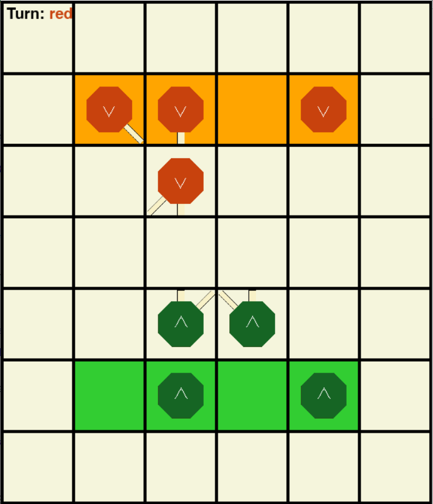

# Octi

A reproduction of a simple board game, Octi, using Pygame. Rules of the game can be found [here](https://tesera.ru/images/items/34098/octi_rules_eng.pdf). To start it, run `Octi.exe`.
 ## Notes
 - Suggestions welcome!
